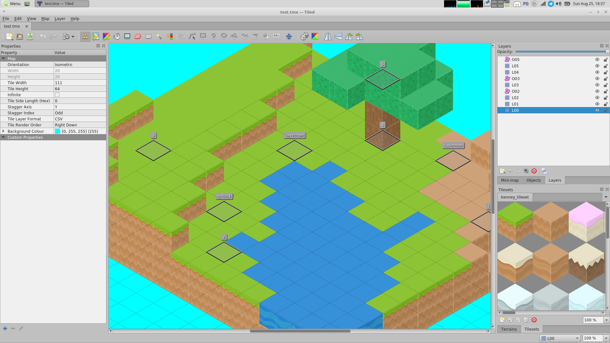
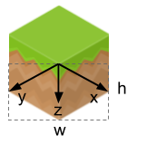

# MAC0346/2019 - Segundo Exercício-Programa


Nesse EP vocês implementarão um visualizador de mapas pseudo-3D isométricos
usand a [LÖVE](https://love2d.org) (**versão 11.2**). O mapa será composto
por blocos vindos de um *tile set*, e poderá ter *sprites* animados e uma
animação de câmera. Em particular, o visualizador irá carregar mapas
exportados do [Tiled Map Editor](https://www.mapeditor.org), um editor de
mapas 2D código aberto e bastante completo e versátil.

**Este EP é em dupla**.

**Prazo: domingo, 8/9, até as 22h**

### Índice

1. [Formato de entrega](#1-formato-de-entrega)
   1. [Projeto LÖVE](#11-projeto-löve)
   2. [Relatório](#12-relatório)
2. [Especificação do visualizador](#2-especificação-do-visualizador)
   1. [Mapas de entrada](#21-mapas-de-entrada)
   2. [Renderizando *tiles*](#22-renderizando-tiles)
   3. [Renderizando *sprites*](#23-renderizando-sprites)
   4. [Câmera](#24-câmera)
3. [Avaliação](#3-avaliação)

## 1. Formato de entrega

Vocês deverão entregar um arquivo comprimido (zip ou tar.gz) contendo

1. O projeto LÖVE do visualizador de vocês (ver [Seção 1.1](#11-projeto-löve))
2. Um relatório com explicações da sua implementação
   (ver [Seção 1.2](#12-relatório))

### 1.1 Projeto LÖVE

Seu projeto LÖVE deverá seguir os conformes da LÖVE, isso é, deve consistir de
uma pasta com um arquivo `main.lua` onde as funções de ponto de entrada para sua
implementação são fornecidas. Além do código-fonte da sua implementação, a pasta
do seu projeto deverá conter todos os ***assets*** usados pelo visualizador,
que, no caso, são as imagens e mapas necessários para renderizar tudo.

Na hora de executar seu projeto, ele deverá receber pela linha de comando o
nome do mapa que irá carregar. Por exemplo, neste repositório o arquivo
`maps/test.lua` é um mapa cujo nome é `test` (isto é, o nome do arquivo sem o
caminho e sem a extensão, por convenção). Então para carregá-lo usando seu
visualizador, o comando seria:

```bash
$ love <seu-projeto> test
```

Onde `<seu-projeto>` é o caminho para a pasta do seu projeto LÖVE.

Recomendamos imitar a estrutura de arquivos deste repositório, com

1. Uma pasta `maps/` contendo os *tilesets* e os mapas a serem carregados
   pelo visualizador
2. Uma pasta `chars/` contendo as *spritesheets* dos personagens que venham a
   aparecer no visualizador

### 1.2 Relatório

Junto com seu projeto LÖVE, vocês deverão entregar um relatório em TXT ou PDF
contendo:

1. Nome e número USP da dupla
2. Breve descrição (uma frase) do que cada módulo da sua implementação faz
3. Quais [tarefas](#3-avaliação) vocês completaram
4. Quaisquer outras observações que vocês achem pertinentes para a correção

**O relatório serve, dentre outras coisas, para facilitar a correção e ajudar
vocês a justificarem suas escolhas de implementação**. Por isso, divulgaremos
primeiro a nota dos EPs que estiverem com relatório completo e adequado.

## 2. Especificação do visualizador



Mapas baseados em *tiles* são bastante comuns em jogos devido à practicidade de
construir uma grande variedade de conteúdo a partir de relativamente poucos
"blocos de construção". Isso é possível mesmo em jogos com representações
visuais que não se encaixam em quadrados propriamente ditos. No caso desse EP,
temos *tiles* **isométricos**, um termo da comunidade de jogos para se referir
a gráficos com perspectiva ortogonal em que os três eixos (x, y, e z) podem ser
vistos de tamanhos (aproximadamente) iguais:


Em jogos, essas proporções são aproximadas, principalmente quando lidamos com
resoluções menores e *pixel art*.

Tendo em vista esses conceitos, o visualizador isométrico que vocês
implementarão deverá:

1. Receber um mapa exportado do *Tiled* em formato `Lua`
2. Renderizar todos os tiles do mapa nas posições corretas
3. Renderizar todos os sprites indicados no mapa nas posições corretas (opcional)
4. Posicionar e mover a câmera de acordo com as indicações no mapa (opcional)

Por exemplo, o resultado esperado do mapa `maps/test.lua` pode ser visto no GIF
no começo desse arquivo (obviamente, o resultado real executa a 60 fps).

### 2.1 Mapas de entrada

Este repositório já vem com um mapa de exemplo (`maps/test.lua`), mas, se
quiserem, podem fazer seus próprios mapas para testar seu EP. Basta usar o
*Tiled* e criar mapas com orientação isométrica. Fornecemos o *tileset*
`maps/kenney_tilesheet.tsx`, que pode ser importado no Tiled (e precisa estar
junto do arquivo `maps/tilesheet_complete.png`.

No Tiled, um mapa é composto por várias camadas (como no GIMP ou Photoshop), mas
cada camada pode ser de um tipo diferente. Neste EP só trabalharemos com camadas
do tipo "*Tile Layer*" e "*Object Layer*". Camadas do primeiro tipo possuem uma
malha isométrica que pode ser preenchida com *tiles* do *tileset* importado.
Camadas do segundo tipo podem ter *tiles* isolados ou outras demarcações; no
caso, usaremos apenas retângulos abstratos para indicar as posições da câmera e
de outros sprites que serão renderizados pelo seu visualizador.

Uma vez feito um mapa, é só exportar ele em formato `Lua`, e depois carregar
o arquivo no projeto de vocês. Para isso, o ideal é usar a função
[love.filesystem.load()](https://love2d.org/wiki/love.filesystem.load).
Inclusive, evitem operar sobre o sistema de arquivos usando as funções de
I/O padrão do `Lua` – ao invés disso, usem as do módulo
[love.filesystem](https://love2d.org/wiki/love.filesystem), que são mais seguras
e robustas.

Uma vez carregado um arquivo de mapa, o desafio é vocês conseguirem extrair as
informações que precisam para renderizá-lo. Abram o arquivo exportado do Tiled
e tentem entender como ele funciona, faz parte do objetivo do EP aprender a
lidar com especificações de ferramantas de *Digital Content Creation* (DCC).
Tem só duas partes do formato exportado que fomos nós que introduzimos: os dados
das câmeras e dos *sprites*, que explicaremos nas seções correspondentes.

### 2.2 Renderizando *tiles*

Cada *tile* no *tileset* é um pedaço retângular da textura, mesmo que a imagem
em si tenha outro formato por ser isométrica. Por isso, o problema de mapas
isométricos é "encaixar" as imagens do *tiles* na hora de posicionar elas, mas
não é nada que um pouco de álgebra linear não resolva.



Os eixos do espaço do "mundo do jogo", quando projetados no plano 2D da
tela, correspondem aos vetores *x*, *y* e *z* mostrados na figura acima. Uma
transformação linear pode mapear coordenadas desse "mundo" para a tela – é
só construir uma matriz 3x2 onde cada coluna é um dos vetores da figura, em
coordenadas da tela:

```math
\begin{bmatrix}
  w/2 & -w/2 & 0 \\
  h/2 & h/2 & 1
\end{bmatrix}
\begin{bmatrix}
  x \\
  y \\
  z
\end{bmatrix}
=
\begin{bmatrix}
  (x - y) * w/2 \\
  (x + y) * h/2 + z
\end{bmatrix}

```

Onde `w` e `h` são a largura e altura da imagem do "chão" de um *tile*
isométrico (o retângulo tracejado na imagem). Na prática, você não precisa
implementar uma transformação usando matrizes, pode só fazer a conta acima
direto no código. **Além disso, apesar do Tiled não ter a coordenada z de
verdade, nesse EP vamos considerar o atributo `offsety` de uma camada a posição
dela ao longo do eixo z**. Isto é, a componente z da posição de todos os *tiles*
de uma camada equivale ao `offsety` daquela camada. Veja o arquivo
`maps/test.lua` para entender onde fica esse atributo.

### 2.3 Renderizando *sprites*

O Tiled pode ser usado para popular um mapa com vários elementos além de apenas
*tiles*. Ele permite criar "objetos" e atribuir propriedades customizadas neles.
Alguns dos objetos que seu visualizador deve ser capaz de processar são
*sprites*. Eles usam uma *spritesheet* e possuem uma única animação. Vocês podem
ver um exemplo em `maps/test.lua`. Mais especificamente, os dados importantes de
cada objeto do tipo *sprite* são:

| Dado | Significado |
| ---  | ----------- |
| id   | Identificador único do objeto no mapa todo |
| name | Nome da *spritesheet* usada pelo *sprite* (sem caminho e extensão) |
| type | Para *sprites*, sempre vale "sprite" |
| x, y | Posição do *sprite* no mundo (componente z é dado pela camada) |
| width, height | Largura e altura de um tile no mundo |
| properties.fps | Taxa de quadros por segundo da animação do *sprite* |
| properties.rows | Número de linhas da *spritesheet* |
| properties.columns | Número de colunas da *spritesheet* |
| properties.flip | Indica se o *sprite* deve ser refletido horizontalmente |
| properties.{offsetx, offsety} | Ponto usado para posicionar *sprite* na tela |
| properties.frames | Sequência dos quadros da animação do *sprite* |

(Campos com "property" são propriedades customizadas)

Para saber a posição "em *tiles*" de um *sprite*, é só dividir a posição
dele pela largura e altura dele: `x/width` e `y/height`. **Não será exigido
renderizar os *sprites* "atrás" de *tiles* bloqueando sua visão**, porque isso
é relativamente complicado. [Mas vale ponto extra ;)](#3-avaliação)

Como o campo `properties.frames` é uma *string* (por restrição do Tiled),
podem usar o seguinte código para ler o valor dos quadros:

```lua
-- string.gmatch() e tonumber() são funções da biblioteca padrão do Lua
for frame_token in obj.properties.frames:gmatch("%d+") do
  local frame = tonumber(frame_token)
end
```

### 2.4 Câmera

Se você só desenhar os *tiles* na tela, provavelmente mal vai conseguir
enxergar o mapa direito. Usando uma "câmera", você pode centralizar diferentes
pontos do mapa para enxergar ele por completo. É uma funcionalidade básica de
muitos jogos.

Assim como *sprites*, teremos alguns objetos nos mapas do Tiled representando
posições de câmera. Seu visualizador deverá navegar por esses pontos, como no
GIF do começo deste documento. Cada objeto de câmera tem os seguintes dados
relevantes:

| Dado | Significado |
| ---- | ----------- |
| id   | Identificador único do objeto no mapa todo |
| name | Número da ordem de posicionamentos da câmera |
| type | Para a câmera, sempre vale "camera" |
| x, y | Posição do câmera no mundo (componente z é dado pela camada) |
| width, height | Largura e altura de um tile no mundo |
| properties.duration | Tempo que leva para a câmera chegar nesse ponto |

Basicamente, cada objeto do tipo câmera no mapa exportado é uma posição pela
qual a câmera deverá passar no seu visualizador. A ordem em que isso deverá
ocorrer é dada pelos nomes do objetos, que são números de 1 a N. Além disso, a
câmera deverá se mover gradativamente até cada ponto, seguindo uma interpolação
linear:

```
posição atual = próximo ponto * progresso + ponto anterior * (1 - progresso)
```

Onde progresso seria um valor em `[0, 1]` indicando quanto a câmera se moveu
em direção ao próximo ponto de sua trajetória. O atributo `properties.duration`
de cada ponto indica quanto tempo deve levar para a câmera *chegar* naquele
ponto vindo do anterior. Fora isso, a câmera deve *ciclar* pelos pontos
indefinidamente.

A posição "em *tiles*" da câmera pode ser calculada da mesma maneira que a dos
*sprites*.

## 3. Avaliação

A avaliação será composta da soma de pontos obtidos por realizar diferentes
**tarefas** na sua implementação. A pontuação máxima é 100 e, novamente, há
tarefas o suficiente para somar mais do que isso. No entanto, as tarefas estão
agrupadas por categoria, e há um limite de nota que você pode obter vindo de
tarefas de uma mesma categoria.

**NO SEU RELATÓRIO, LEMBRE DE INDICAR QUAIS TAREFAS VOCÊS CUMPRIRAM**.
Sugiro usar os códigos!

| Categoria                 | Limite       | Código |
| ------------------------- | ------------ | ------ |
| Apresentação              |  40          | Ax     |
| Funcionalidade            |  80          | Rx     |
| Qualidade de código       |  30          | Qx     |

Você só pode ganhar nota das categorias Sx e Cx se tiver feito todas as tarefas
da categoria Tx.

| Código | Tarefa                                                    | Máximo |
| ------ | --------------------------------------------------------- | ------ |
| A1     | Atender o formato de entrega                              | 10     |
| A2     | Executar sem erros                                        | 10     |
| A3     | Relatório completo e adequado                             | 20     |
| A4     | Arquivo [conf.lua][1] apropriado                          | 10     |
| A5     | Mapas adicionais de teste                                 | 10     |
| R1     | Renderizar os *tiles* corretamente                        | 30     |
| R2     | Renderizar os *sprites* corretamente                      | 20     |
| R3     | Animar a câmera corretamente                              | 20     |
| R4     | Efeitos adicionais (1)                                    | 30     |
| Q1     | Passar no [luacheck](https://github.com/mpeterv/luacheck) | 20     |
| Q2     | Organizar em módulos (2)                                  |  5     |
| Q3     | Organizar em funções (3)                                  |  5     |
| Q4     | Nomes claros de variáveis, funções e módulos              |  5     |
| Q5     | Tratar problemas na entrada                               |  5     |

(1) Sugestões:

+ Sombras nos *sprites*
+ Interpolações mais suaves do movimento das câmeras
+ Múltiplas animações nos *sprites* (precisa incluir exemplos que funcionem)
+ Sprites aparecerem corretamente atrás de tiles (20 pontos!)

(2) Pontuação máxima se nenhum módulo tiver mais de 100 linhas (e nenhuma delas
mais de 100 caracteres).

(3) Pontuação máxima se nenhuma função tiver mais de 15 linhas (e nenhuma delas
mais de 100 caracteres).

[1]: https://love2d.org/wiki/Config_Files

